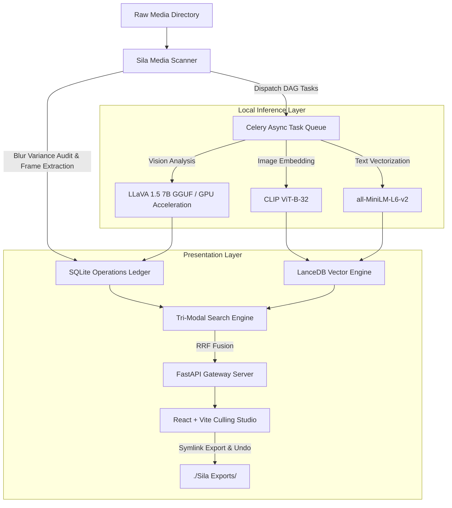

<div align="center">


# SILA

**Sift raw media chaos into searchable, reversible, local-first moment intelligence.**

[](LICENSE)
[](https://python.org)
[](https://fastapi.tiangolo.com)
[](https://react.dev)
[](https://lancedb.com)

*Find the moment, not the file.*

</div>

---

## ✨ What is Sila?

**Sila** is an open-source, local-first multimodal media studio designed for creators, filmmakers, and photographers. It indexes raw photo and video archives locally, automatically detects technical quality (blur and exposure), extracts semantic scene descriptions via local Vision LMs, and lets you execute natural language hybrid searches—**without subscriptions, cloud APIs, or moving your original 4K source files.**

---

## 🚀 Key Features

* **⚡ 100% Local & Private**: Auto-detects and uses Apple Metal (MPS) on Mac or CUDA on Windows/Linux. No data ever leaves your computer.
* **🔎 Tri-Modal Hybrid Search**: Combines exact keyword matching, CLIP image embeddings (`clip-ViT-B-32`), and MiniLM semantic text embeddings (`all-MiniLM-L6-v2`) using **Reciprocal Rank Fusion (RRF)**.
* **📸 Non-Destructive "Zero-Byte" Virtual Albums**: Instantly exports selected search results into `./Sila Exports/<Album_Name>` via filesystem symbolic links. Takes 0 extra disk space and includes a 1-click **Undo Transaction Rollback**.
* **👁️ Local Vision Language Model**: Automated scene captioning, lighting analysis, and cognitive tag generation using LLaVA 1.5 7B GGUF.
* **🎨 Premium Aesthetic UI**: High-speed culling workspace built with React, Vite, Framer Motion, glassmorphism, and custom Aesop-inspired typography.
* **🛡️ Hardened Cache Engine**: All SQLite databases, LanceDB vector tables, and ML model weights are safely isolated inside a local `.sila_cache` directory.

---

## 🏗️ System Architecture



---

## 📦 Getting Started

### 1. Prerequisites

* **Python 3.11+**
* **Node.js 18+** & `npm`
* **Docker Desktop** *(Recommended for easy database setup, but 100% optional)*

### 2. Download the Repository

Clone the Sila project to your local machine:

```bash
git clone https://github.com/amitjoshi9627/Sila.git
cd sila

```

---

### Option A: The "Magic" Setup (Recommended)

If you have `make` installed (standard on Mac/Linux/WSL), Sila will automatically detect your OS, select optimal hardware acceleration, sync dependencies, and pre-fetch ML models.

**1. Install & Sync Everything:**

```bash
make install
```

*(Automatically syncs Python dependencies, pre-downloads ML model weights via `scripts/download_models.py`, and installs UI dependencies).*

**2. Boot the Sila Engine (Backend + Database):**

```bash
make start
```

*(Includes automatic pre-flight checks to clear stale Redis containers or port conflicts on ports 6379 and 8000).*

**3. Launch the UI Dashboard (In a new terminal window):**

```bash
make dashboard
```

**4. Ingest your raw footage (Includes real-time progress bar):**

```bash
make run MEDIA_DIR=/path/to/your/raw/footage
```

*(You can also run model pre-fetching independently at any time via `make download-models`).*

---

### Option B: The Manual Setup (Windows / No `make`)

If you are running standard Windows or prefer granular control, run these commands:

**1. Install Dependencies & Pre-fetch Models:**

```bash
# 1. Install 'uv' and sync Python packages
curl -LsSf https://astral.sh/uv/install.sh | sh
uv sync

# 2. Pre-fetch ML models into .sila_cache/
uv run python scripts/download_models.py

# 3. Install UI dependencies
cd src/sila/ui && npm install
cd ../../..
```

**2. Boot the Sila Engine:**
Sila's architecture is dynamic. Choose the command that matches your setup:

* **Docker Installed (Any OS):** `docker compose up -d`
* **No Docker (Pure Native Python):** `uv run honcho start -f Procfile.nodocker`
*(Requires a local Redis server running. Windows users can install Redis via WSL by running `sudo apt install redis-server` and `sudo service redis-server start`).*

**3. Launch the UI Dashboard:**

```bash
cd src/sila/ui && npm run dev
```

**4. Ingest your raw footage:**

```bash
uv run python -m main index --path /path/to/your/raw/footage
```

---

## 🧹 Maintenance & Cleanup

Sila provides granular Makefile targets for workspace and container maintenance:

* **Reset Databases & Ports (Preserves downloaded ML models):**
  ```bash
  make clean
  ```
  *(Clears stale Redis containers, port bindings, frame thumbnails, and SQLite/LanceDB data **without** deleting pre-downloaded ML model weights).*

* **Full Factory Reset (Purges everything including ML models):**
  ```bash
  make clean-all
  ```
  *(Deletes all databases, extracted frames, and model weights in `.sila_cache/models` and `.sila_cache/huggingface`).*


---

## ⚙️ Configuration (`config.py`)

Sila uses a centralized, single-source-of-truth configuration file located at `config.py` in the root folder. You can easily customize cache paths, database URIs, model weights, and server parameters:

```python
# config.py
SILA_CACHE_DIR = "<PROJECT_ROOT>/ .sila_cache"
EXPORTS_DIR = "<PROJECT_ROOT>/ Sila Exports"

# Model Configurations
LLAVA_REPO_ID = "second-state/Llava-v1.5-7B-GGUF"
CLIP_MODEL_NAME = "sentence-transformers/clip-ViT-B-32"
TEXT_EMBEDDING_MODEL_NAME = "sentence-transformers/all-MiniLM-L6-v2"

```

---

## 🗺️ Roadmap

* [x] **v0.1**: Non-destructive symlink export engine with transaction ledger rollbacks.
* [x] **v0.2**: Tri-modal Hybrid Search Engine (Keyword + CLIP Image + MiniLM Text with RRF).
* [x] **v0.3**: Local LLaVA 1.5 7B GGUF integration on Apple Metal GPU.
* [x] **v0.4**: Aesop-styled React culling studio with custom dialog system & Deep Player modal.
* [x] **v0.5**: Centralized `.sila_cache` directory, dynamic cross-platform setup, and `config.py` refactor.
* [ ] **v1.0**: Timeline XML export for DaVinci Resolve & Adobe Premiere Pro.

---

## 📄 License

Distributed under the **Apache 2.0 License**. Free and open-source for creators forever.
